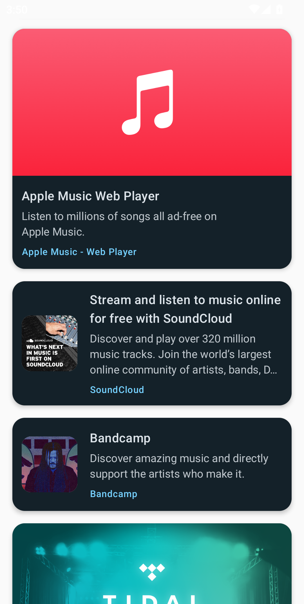

# LinkPreview Compose Library

A modern, flexible, and customizable Android Jetpack Compose component for displaying link previews with OpenGraph/Meta tags support. Supports memory cache, custom loaders, and easy integration into lists (LazyColumn, etc).

---

## Features
- Subcompose pattern for flexible UI
- OpenGraph and Meta tags parsing
- Memory cache with customizable policy
- Easy integration with LazyColumn and lists
- Supports custom loaders and request builders
- Disk cache and advanced features planned

## Installation

Add the dependency to your `build.gradle.kts`:

```kotlin
dependencies {
    implementation("ru.iquack.linkpreview:library:<latest-version>")
}
```

## Quick Start

```kotlin
val state = rememberLinkPreviewState()
SubcomposeLinkPreview(
    modifier = modifier,
    state = state,
    loading = { LinkPreviewCardLoading(Modifier.fillMaxWidth()) },
    failure = { LinkPreviewCardError(it) },
    idle = { LinkPreviewCardIdle(it) },
    success = { LinkPreviewCardSuccess(it) }
)
```

Or use directly in a list:

```kotlin
val stateHolder = rememberLinkPreviewStateHolder()
LazyColumn {
    items(urls) { url ->
        val state = stateHolder.getState(url)
        SubcomposeLinkPreview(
            modifier = modifier,
            state = state,
            loading = { LinkPreviewCardLoading(Modifier.fillMaxWidth()) },
            failure = { LinkPreviewCardError(it) },
            idle = { LinkPreviewCardIdle(it) },
            success = { LinkPreviewCardSuccess(it) }
        )
    }
}
```

## API Overview

- `rememberLinkPreviewRequest()` - Remembers and builds a LinkPreviewRequest for the given URL and options.
- `rememberLinkPreviewLoader()` - Remembers and provides a LinkPreviewLoader instance with the given cache and policy.
- `rememberLinkPreviewState()` — Remembers and manages the state of a link preview request for the given URL.
- `rememberLinkPreviewStateHolder()` — Remembers a LinkPreviewStateHolder for managing link preview states in lists.
- `SubcomposeLinkPreview(...)` — Composable for displaying a link preview with subcompose pattern.

## Main Classes Overview

- **LinkPreviewRequest** — Describes a request for loading a link preview, including URL and cache policy.
- **LinkPreviewLoader** — Handles the actual loading and parsing of link previews, supports custom cache and request configuration.
- **LinkPreviewState** — Represents the state of a link preview request: Idle, Loading, Success, or Error.
- **LinkPreviewStateHolder** — Stores and manages preview states for multiple URLs, ideal for use in lists (e.g., LazyColumn).
- **LinkPreview** — Data model representing the parsed preview information (title, description, image, etc) for a link.

## Screenshot



## License

GNU General Public License v3.0. See [LICENSE](LICENSE) for details.

---

**Made with ❤️ by iQuack**
